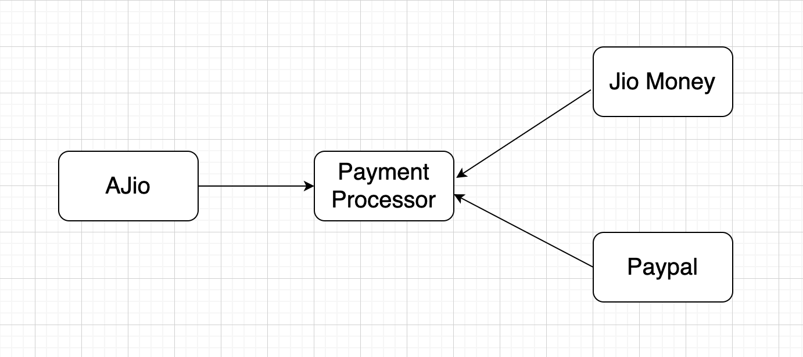

### Following the dependency inversion principle, Ajio now depends on an abstraction called PaymentProcessor



```
class Ajio {
  constructor(paymentProcessor) {
    this.paymentProcessor = paymentProcessor;
  }

  purchase(priceInINR) {
    this.paymentProcessor.purchase(priceInINR)
  }
}

class JioMoneyPaymentProcessor {
  constructor(user) {
    this.jioMoney = new JioMoney(user);
  }

  makePayment(priceInINR) {
    this.jioMoney.makePayment(priceInINR)
  }
}

class PaypalPaymentProcessor {
  constructor(user) {
    this.user = user;
    this.paypal = new Paypal();
  }

  makePayment(priceInINR) {
    this.paypal.makePayment(this.user, priceInINR/74.5)
  }
}

class JioMoney {
  constructor(user) {
    this.user = user;
  }

  makePayment(priceInINR) {
    console.log(`${this.user} made a purchase of ${priceInINR})`}
  }
}

class Paypal {
  makePayment(user, priceInDollars) {
    console.log(`${user} made a purchase of ${priceInDollars})`}
  }
}

const ajio = new Ajio(new JioMoneyProcessor('UserName'))
ajio.purchase(200);
```