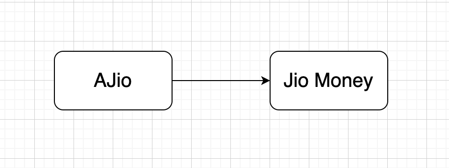

### Initially AJio is depending on JioMoney directly to make payments (in INR) in order to complete purchases



```
class Ajio {
  constructor(user) {
    this.jioMoney = new JioMoney(user);
  }

  purchase(priceInINR) {
    this.jioMoney.purchase(priceInINR)
  }
}

class JioMoney {
  constructor(user) {
    this.user = user;
  }

  makePayment(priceInINR) {
    console.log(`${this.user} made a purchase of ${priceInINR})`}
  }
}

const ajio = new Ajio('UserName');
ajio.purchase(200);
```

### Later, AJio decides to add another payment mechanism to complete international purchases in $ through Paypal, which has a slightly different API, takes in user as argument

```
class Ajio {
  constructor(user) {
    this.user = user;
    this.jioMoney = new JioMoney(user);
    this.paypal = new Paypal();
  }

  purchase(priceInINR) {
    if(this.user.paymentMethod === 'jioMoney') {
      this.jioMoney.purchase(priceInINR)
    } else {
      this.paypal.makePayment(priceInINR / 74.5)
    }
  }
}

class JioMoney {
  constructor(user) {
    this.user = user;
  }

  makePayment(priceInINR) {
    console.log(`${this.user} made a purchase of ${priceInINR})`}
  }
}

class Paypal {
  makePayment(user, priceInDollars) {
    console.log(`${user} made a purchase of ${priceInDollars})`}
  }
}

const ajio = new Ajio('UserName');
ajio.purchase(200);
```