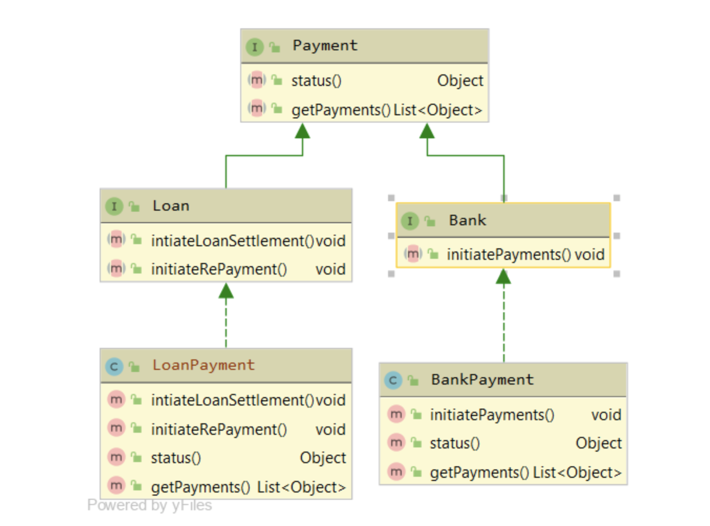

## Segregate the interfaces into 3 different interfaces



```
public interface Payment {
  Object status();
  List<Object> getPayments();
}

public interface Bank extends Payment {
  void initiatePayments();
}

public interface Loan extends Payment {
  void intiateLoanSettlement();
  void initiateRePayment();
}

public class BankPayment implements Bank {

  @Override
  public void initiatePayments() {
      // ...
  }

  @Override
  public Object status() {
      // ...
  }

  @Override
  public List<Object> getPayments() {
      // ...
  }
}

public class LoanPayment implements Loan {

  @Override
  public void intiateLoanSettlement() {
      // ...
  }

  @Override
  public void initiateRePayment() {
      // ...
  }

  @Override
  public Object status() {
      // ...
  }

  @Override
  public List<Object> getPayments() {
      // ...
  }
}
```