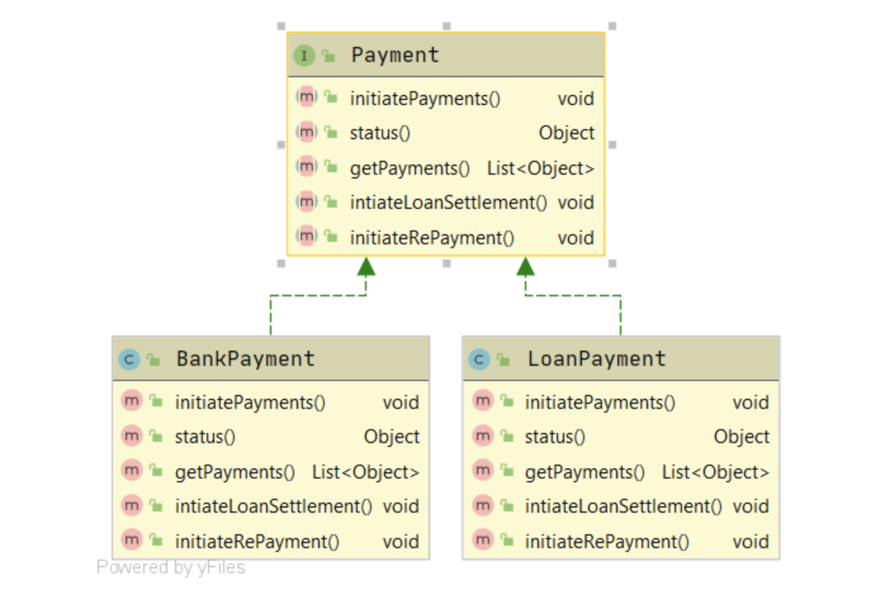

# Interface Segregation Principle

## Initial Interface and implementation

```
public interface Payment { 
  void initiatePayments();
  Object status();
  List<Object> getPayments();
}

public class BankPayment implements Payment {

  @Override
  public void initiatePayments() {
     // ...
  }

  @Override
  public Object status() {
      // ...
  }

  @Override
  public List<Object> getPayments() {
      // ...
  }
}
```


##  More methods get added to the original interface, hence all the implementers need to implement the method even if they dont need it. LoanRepayment needs the new methods but original BankPayments does not



```
public interface Payment {
  void initiatePayments();
  Object status();
  List<Object> getPayments();
  void intiateLoanSettlement();
  void initiateRePayment();
}

public class BankPayment implements Payment {

  @Override
  public void initiatePayments() {
      // ...
  }

  @Override
  public Object status() {
      // ...
  }

  @Override
  public List<Object> getPayments() {
      // ...
  }

  @Override
  public void intiateLoanSettlement() {
      throw new UnsupportedOperationException("This is not a loan payment");
  }

  @Override
  public void initiateRePayment() {
      throw new UnsupportedOperationException("This is not a loan payment");
  }
}


public class LoanPayment implements Payment {

  @Override
  public void initiatePayments() {
      throw new UnsupportedOperationException("This is not a bank payment");
  }

  @Override
  public Object status() {
      // ...
  }

  @Override
  public List<Object> getPayments() {
      // ...
  }

  @Override
  public void intiateLoanSettlement() {
      // ...
  }

  @Override
  public void initiateRePayment() {
      // ...
  }
}
```

